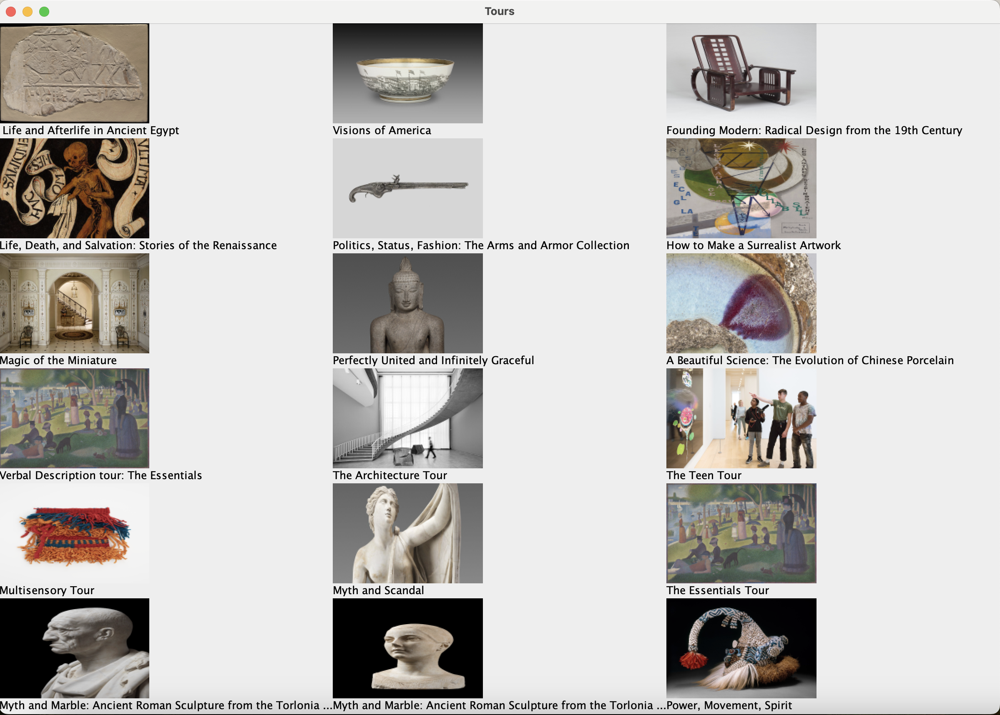
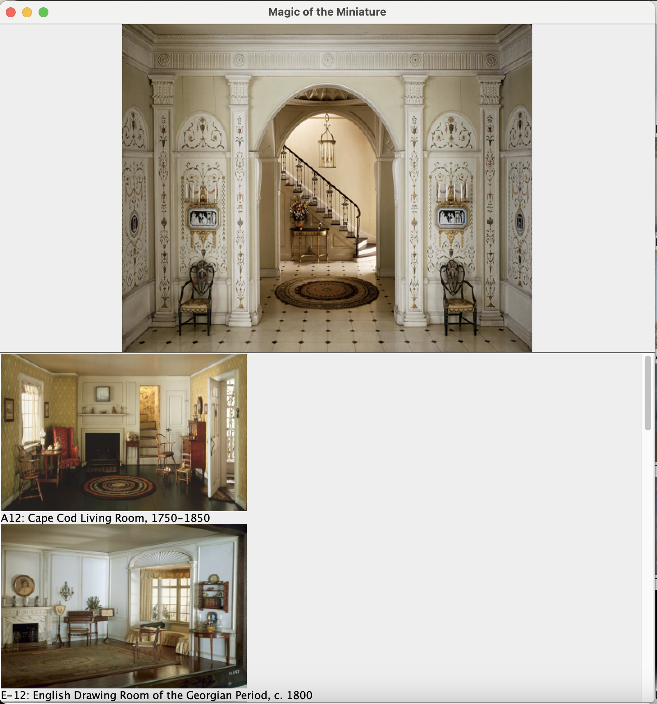
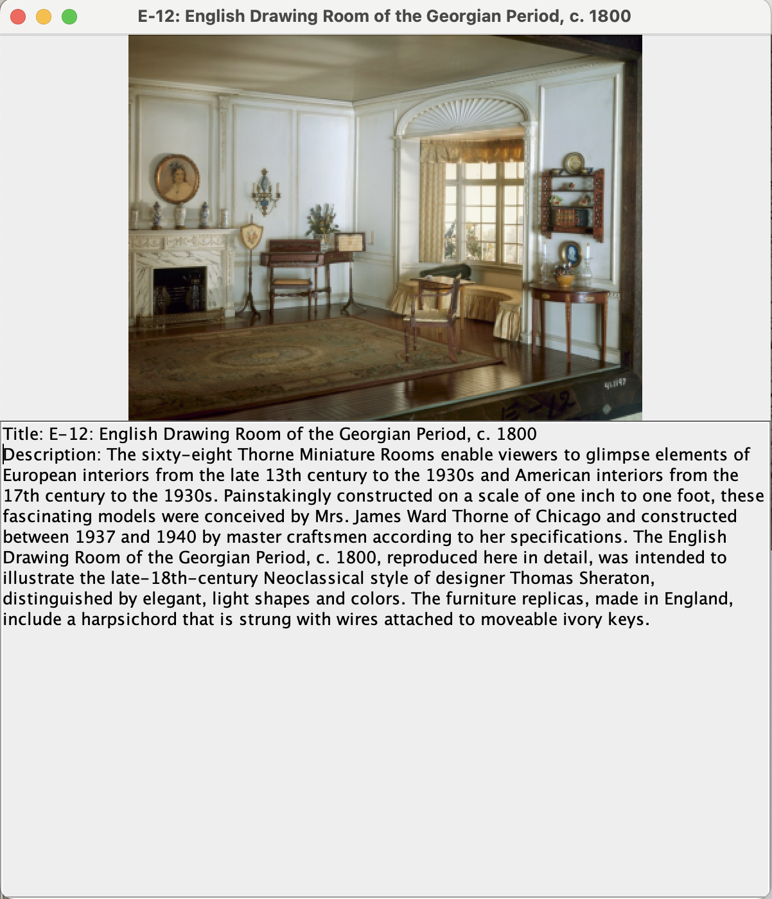

### Art Institute of Chicago Tours and Artworks

This program uses the Art Institute of Chicago's public API to fetch and display information about available tours and 
featured artworks.

### Description

This Java program allows users to virtually experience the tours offered by the Art Institute of Chicago. It retrieves 
data from the museum’s public API using Retrofit and RxJava, fetching a list of 18 curated tours, each represented by 
the tour's title and thumbnail image. Each tour image is clickable and opens a new window featuring a larger version of
the tour image, with the tour title displayed in the window’s title bar. Below the tour image, a scrollable panel 
presents thumbnail images and titles of the artworks featured in that specific tour. Clicking on an artwork opens 
another window that displays the artwork’s image, title, and description, which are retrieved through API calls. 
The project makes asynchronous API requests to keep the program responsive and includes error handling to account for 
missing data, such as tours without artworks or artworks without descriptions. This application allows users to explore 
the museum’s tours from the comfort of their own home while demonstrating skills in Java and API integration.

### Dependencies

- Java 11 or higher
- Gradle 
- Windows 10, macOS, or any OS with Java support
- Internet connection

#### Gradle-managed libraries:
- Retrofit 2.11.0
- Gson Converter
- RxJava3 Adapter
- JUnit 5 

### Screenshots

### Author
**Shoshana Aharon**

#### Links

- [Art Institute of Chicago API Documentation](https://api.artic.edu/docs/)